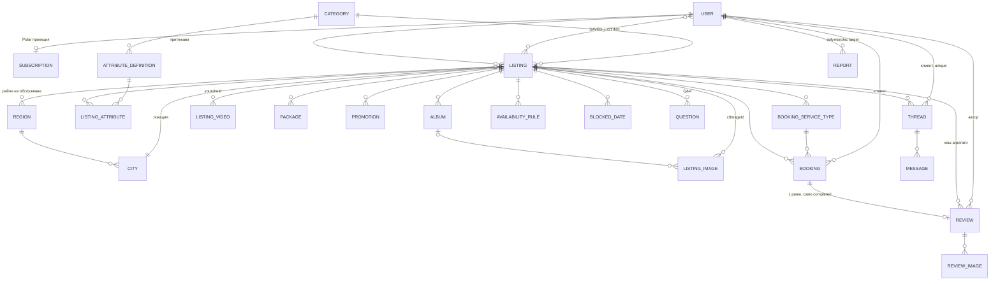

# EVENT-REVIEW — Technical Spec

**Дата:** 2026-07-06
**Статус:** Стекът и архитектурните принципи са фиксирани (grilling сесия 2026-07-06). Етапи 3–10 (folder structure, DB schema, API, UI, design system, flows, ER, roadmap) се одобряват поотделно преди код.
**Референции:** PRD `2026-07-04-event-review-platform-design.md`, глосарий `CONTEXT.md`, решения `docs/adr/0001–0004`, DAL методология `demo/pro-dal-local-main`, booking референция `demo/cal.diy-main`.

## 1. Стек

| Слой | Технология | Бележки |
|---|---|---|
| Framework | **Next.js (latest, App Router, RSC)** | `output: "standalone"`, Turbopack |
| Език | TypeScript (strict) | |
| API граница | **tRPC v11** + TanStack Query | Единствената клиентска граница — без Server Actions (ADR 0002). RSC prefetch/hydrate: `createTRPCOptionsProxy` + `HydrateClient` |
| Валидация | **Zod v4** | Схемите живеят в `*.dto.ts` и се преизползват като `.input()` на процедурите |
| ORM | **Drizzle** + `drizzle-kit` миграции | Не Prisma; cal.diy е само референция (ADR 0001) |
| База | **Neon Postgres (EU)** | Driver: `neon-serverless` WebSocket Pool (интерактивни транзакции). Branching за тест на миграции |
| Auth | **Better Auth** | Email/парола + Google. Admin = флаг |
| Billing | **Polar** (`@polar-sh/better-auth`: checkout, portal, webhooks) | Merchant of Record — ДДС/фактури. Sandbox за dev |
| Снимки | **Cloudflare Images** | Direct creator upload (клиентът качва директно), variants: thumb/card/gallery/cover |
| Видео | **YouTube embed** | Пазим само video ID; Zod валидация на URL. Без видео хостинг |
| Email | **Resend** + React Email | Транзакционни (PRD §9) |
| UI | **Tailwind v4 + shadcn/ui** (Radix), Lucide, React Hook Form + zodResolver | Луксозният вид идва от собствени design tokens върху shadcn |
| i18n | **next-intl** | BG default без префикс, `/en/...` префикс; типизирани ключове |
| Хостинг | **Hostinger VPS** + Docker + Nginx/Caddy + **Cloudflare CDN** | ADR 0003. GitHub Actions build+deploy |
| Cron | Системен crontab → защитени вътрешни endpoints | Сваляне след гратис, изтичане на промоции, review reminders, auto-complete на резервации |
| Търсене | Postgres full-text (`tsvector`) | Външна търсачка — извън V1 |

## 2. Архитектура

### 2.1 Слоеве (DAL/DTO/Policy методологията — навсякъде)

```
┌─ Публични страници (RSC, SEO) ────► DAL директно (без слой отгоре)
│
├─ Интерактивен клиент ──► tRPC процедура ──► Policy ──► DAL / Service ──► Drizzle
│                          (auth context,     (чисти
│                           Zod .input()       функции)
│                           от DTO схемата)
│
└─ Webhooks (Polar) / Cron ──► Service ──► DAL
```

- **`*.dal.ts`** — `import "server-only"`; auth-scoped клас със статични фабрики (`.forUser()`, `.public()`); **единственото място, което пипа Drizzle**; връща само DTO-та, никога ORM редове.
- **`*.dto.ts`** — Zod схеми + изведени типове. Input схеми и Output (DTO) схеми.
- **`*.policy.ts`** — чисти функции `can*(user, resource)`; викат се от DAL/процедурите, тестват се без база.
- **`*.service.ts`** — само където има многостъпкова оркестрация в транзакция (потвърждение на резервация, абонаментен lifecycle, downgrade избор). Простите CRUD-ове НЕ получават service слой.
- Съответствие с изискваните стандарти: DAL = Repository; Service Layer = `*.service.ts`; DTO/Validation = `*.dto.ts`; Policies/Authorization = `*.policy.ts` + tRPC middleware; SOLID/DRY/KISS = конвенциите по-горе, без спекулативни абстракции.

### 2.2 Auth и абонаменти

- Better Auth (Drizzle adapter, схема в нашата база) + Polar плъгин: `createCustomerOnSignUp`, checkout по slug (`standard-monthly`, `standard-yearly`, `premium-monthly`, `premium-yearly`), customer portal.
- **Истината за абонамента живее при Polar**; локално пазим проекция (`subscription` таблица), обновявана от webhooks (`onSubscriptionActive/Canceled/Revoked`, `onOrderPaid`). Entitlement проверките (колко обяви може да публикува) четат локалната проекция.
- Lifecycle: неуспешно плащане → Polar retry → 7 дни гратис (наш cron проверява) → обявите `hidden`. Подновяване → едно-кликово връщане. Downgrade Premium→Standard → потребителят избира 1 обява, останалите `hidden`.
- Промоции: Standard докупува еднократно през Polar (one-time product); Premium има конфигуриран брой едновременни. Прозорецът е календарен — тече и при скрита обява.

### 2.3 Booking (собствена имплементация, cal.diy като спецификация)

- Календарът е **per-обява** (ADR 0004): `WeeklySchedule`, `BlockedDate`, `BookingServiceType` (целодневна | часова с продължителност), `Booking`.
- Статуси: `pending → confirmed/declined → completed/cancelled`. `pending` не блокира. Потвърждението е **една транзакция**: провери свободност → потвърди → блокирай датата → auto-decline на конкурентните pending. Отмяна само до датата на събитието; след нея cron маркира `completed` (терминален; само админ анулира).
- Слот-изчисление само за часовите услуги: timezone-safe (Europe/Sofia стандарт, UTC в базата), генериране на слотове от седмичното разписание минус блокирани/заети.
- Ревю право: само `completed` резервация, 1 ревю на резервация.

### 2.4 Медия pipeline

Клиент → tRPC `media.requestUpload` (policy: собственик, лимити) → Cloudflare Direct Upload URL → клиентът качва директно → tRPC потвърждава и записва `image_id`. Сървърът никога не проксира байтове. Variants се дефинират еднократно в Cloudflare.

### 2.5 SEO и i18n

- SSR на всички публични страници; гео+категория landing-и (`/fotografi/sofia`); JSON-LD (LocalBusiness, Review, AggregateRating); sitemap от cron/build; канонични URL-и.
- next-intl: BG без префикс, EN с `/en/...`. UI низовете — преведени; вендорското съдържание — както е въведено.

### 2.6 Скалиране и сигурност (100k+ потребители)

- Индекси по всички филтърни колони; кеширани агрегати на обявата (rating, review_count) преизчислявани при ново ревю; Postgres full-text с `tsvector` колона + GIN.
- Next.js кеширане: публичните страници `revalidate` (ISR) + on-demand revalidation при промяна на обява; Cloudflare CDN отпред.
- Rate limiting на мутациите (запитвания, Q&A, report) — Better Auth rate limit + per-procedure middleware.
- Валидация на всяка граница (tRPC input + DAL повторно при нужда); policies за всяка мутация; admin процедурите зад `adminProcedure` middleware.
- GDPR: изтриване = анонимизация на ревюта («Изтрит потребител»), пълен export; данните в EU (Neon EU, Hostinger EU).

## 3. Folder Structure (одобрен)

```
src/
├── app/
│   ├── [locale]/                  # next-intl: BG без префикс, /en/... с префикс
│   │   ├── (public)/              # RSC + DAL директно: page (начална), [category],
│   │   │                          #   [category]/[city], obiava/[slug], tarsene
│   │   ├── (auth)/                # вход, регистрация
│   │   ├── profil/                # izbrani, rezervacii, saobshtenia, revyuta
│   │   │   └── dostavchik/        # obiavi, kalendar, abonament, promotirane
│   │   └── admin/
│   └── api/
│       ├── auth/[...all]/         # Better Auth + Polar плъгин (checkout/portal/webhooks)
│       ├── trpc/[trpc]/
│       └── cron/[job]/            # Bearer secret: grace-expiry, promo-expiry,
│                                  #   review-reminder, auto-complete
├── data/<domain>/                 # users, catalog, booking, reviews, billing,
│   │                              #   messaging, media, admin
│   └── <domain>.dal.ts .dto.ts .policy.ts [.service.ts при оркестрация]
├── db/schema/<domain>.ts + index.ts    # neon-serverless Pool
├── trpc/init.ts + routers/ + server.tsx + client.tsx + query-client.ts
├── components/ui/ + components/<domain>/
├── lib/  ├── i18n/ + messages/  └── middleware.ts
```

Решения: URL на обява е плосък `/obiava/[slug]` (стабилен при смяна на град/категория; slug global unique); Polar webhooks през Better Auth плъгина (един endpoint).

## 4. DB Schema (одобрена)

Better Auth таблици + разширен `user` (isAdmin, phone, deletedAt, avgResponseMinutes кеш).

- **catalog:** `category` (slug, nameBg/En), `region`/`city` (28 области), `listing` (ownerId, categoryId, slug unique, status: draft→pending_approval→published⇄hidden/rejected/removed, кеш: ratingAvg/reviewCount/priceFrom), `listingServiceRegion` (M:N), `attributeDefinition` (categoryId, type, options jsonb, showAsFilter/Chip) + `listingAttribute` (value jsonb), `album`/`listingImage` (cfImageId), `listingVideo` (youtubeId), `package`, `savedListing` (composite PK), `promotion` (source: premium_included/purchased, startsAt/endsAt календарен, polarOrderId)
- **booking:** `bookingServiceType` (kind: full_day/hourly, durationMinutes), `availabilityRule` (weekday, start/end), `blockedDate`, `booking` (status: pending/confirmed/declined/auto_declined/completed/cancelled_by_*, eventDate, startTime/endTime, phone). ⭐ Partial unique index `(listingId, eventDate) WHERE status='confirmed' AND kind='full_day'` — DB-гаранция срещу double-booking.
- **reviews:** `review` (bookingId UNIQUE, 5 под-оценки + ratingOverall stored, replyText/replyUpdatedAt — един редактируем отговор, editableUntil +48ч), `reviewImage`, `question` (answerText inline), `report` (polymorphic target, status open/resolved)
- **billing:** `subscription` (Polar проекция: plan, status, currentPeriodEnd, graceUntil), `setting` (key/value jsonb)
- **messaging:** `thread` ((listingId, customerId) UNIQUE, lastMessageAt), `message` (eventDate/phone на първото запитване, readAt)

Индекси: listing (categoryId+status, cityId, ratingAvg), tsvector GIN (title+description), promotion (endsAt), booking (listingId+eventDate+status), review (listingId).

## 5. API структура (одобрена)

Процедурни нива: `public` → `protected` → `vendor` (собственост + per-операция entitlement, не blanket абонамент) → `admin`.

Роутери: **catalog** (listing.list/create/update/submit/hide/restore, package.*, video.*, category.list, location.search), **media** (requestUploadUrl → CF direct upload, confirmUpload, remove), **booking** (availability.month, slots.day, request, confirm ⭐транзакция+auto-decline, decline, cancel, vendorCalendar.*, listMine), **reviews** (create — само completed, update ≤48ч, reply, listByListing, qa.*, report.create), **billing** (subscription.mine, promotion.activate/checkout, downgrade.keepListing), **messaging** (inquiry.create, thread.*, message.send, markRead), **saved** (toggle, list), **admin** (dashboard.stats, approvals.*, reports.*, users.*, listings.*, categories/attributes/locations.*, settings.*).

RSC → DAL директно: начална, категориен листинг (първи render), гео landing, профилна страница, търсене, sitemap — `.public()` фабрики + ISR.

## 6. UI Components (одобрени)

shadcn фундамент (Dialog→Drawer на mobile, Carousel/Embla, Sonner, Calendar). По домейни: Layout (Header, MobileBottomNav: Търси/Избрани/Съобщения/Профил), Catalog (⭐`ListingCard`, `SearchHero`, `FiltersPanel` sidebar/drawer, `PromotedCarousel`, `Gallery` lightbox, `PackageCard`, `ListingMap` — Leaflet+OSM dynamic import, `SaveButton`), Vendor (`ListingWizard` multi-step, `ImageUploader` CF direct, `YouTubeInput`), Booking (`AvailabilityCalendar`, `SlotPicker`, `BookingRequestForm`, `WeeklyScheduleEditor`, `ConfirmDeclineDialog`), Reviews (`RatingStars`, `SubRatingsBars`, `ReviewCard`, `ReviewForm`, `QASection`, `ReportButton`), Messaging (`ThreadList`, `ChatWindow` polling, `InquiryForm`, `ResponseTimeBadge`), Billing (`PlanPricingTable`, `SubscriptionStatusCard`, `PromotionManager`, `DowngradeListingPicker`), Admin (`StatsCards`, опашки, таблици, `CategoryAttributeEditor`, `SettingsForm`). Sticky «Резервирай» бар на профилна страница (mobile).

## 7. Design System (одобрен)

Неутрална «галерийна» основа + един дълбок акцент; лукс чрез типография и въздух, не ефекти (Liquid Glass отхвърлен — performance).

| Token | Light | Dark |
|---|---|---|
| background | `#FAFAF9` | `#0C0A09` |
| card | `#FFFFFF` | `#1C1917` |
| foreground | `#1C1917` | `#FAFAF9` |
| muted-fg | `#78716C` | `#A8A29E` |
| border | `#E7E5E4` | `#292524` |
| primary (вино) | `#9F1239` | `#FB7185` |
| accent-gold (само звезди + промо бадж) | `#A16207` | `#EAB308` |

Типография (пълна кирилица): заглавия **Cormorant** (serif 500–600), UI/body **Inter** (variable). Base 16px, скала 12/14/16/18/24/32/48, lh 1.5, tabular-nums за цени. Radius 12/8/full; сенки почти никакви — 1px бордове; motion 150–250ms ease-out, само transform/opacity, reduced-motion уважен. Breakpoints 375/768/1024/1440, touch ≥44px.

## 8. User Flows (одобрени)

- **F1 Клиент:** търсене → листинг с филтри → профилна страница → запитване (чат) или «Резервирай» (`pending`) → потвърждение + email → след събитието cron `completed` → review reminder → ревю (верифицирано) → вендорски отговор.
- **F2 Вендор:** регистрация → Polar checkout → ListingWizard → подаване → админ одобрение → `published` → календар setup → първо запитване (response-time се мери).
- **F3 Абонамент:** fail → Polar retry → `past_due` + email → 7 дни гратис (cron) → `hidden` → подновяване → едно-кликово връщане без ново одобрение. Резервации/чатове работят непрекъснато.
- **F4 Downgrade:** задължителен interstitial «Избери коя обява остава».
- **F5 Промотиране:** Premium активира слот; Standard → Polar one-time; cron сваля изтеклите.
- **F6 Админ:** опашка одобрения (преглед като клиент), опашка сигнали, ръчни операции.
- **F7 GDPR:** изтриване = анонимизация (ревюта остават «Изтрит потребител») + Polar customer delete; async JSON експорт.

## 9. ER Diagram (одобрена)



## 10. Roadmap (одобрен)

- **M0 Фундамент:** repo, стек setup, auth, tRPC скелет, i18n, Docker+CI→VPS, seed (17 категории, 28 области). ✅ staging deploy, вход работи.
- **Фаза 1 Каталог:** M1.1 обяви (Wizard, атрибути — вкл. дефиниране за 15-те категории); M1.2 публично лице (профилна, листинг+филтри, гео landing, търсене, SEO); M1.3 избрани + запитвания/чат + email-и. ✅ клиент намира и пита; вендор отговаря. (Без лимити до Ф2.)
- **Фаза 2 Монетизация:** M2.1 Polar (checkout, проекция, entitlement-и, гратис lifecycle, downgrade); M2.2 промотиране + карусел; M2.3 админ панел (+ `pending_approval` влиза в сила). ✅ sandbox checkout→публикуване; fail→скриване→връщане.
- **Фаза 3 Booking и ревюта → 🚀 старт:** M3.1 booking (календар, слотове, транзакция, cron auto-complete); M3.2 ревюта (под-оценки, агрегати, reminder, Q&A, report, JSON-LD); M3.3 GDPR, rate limiting, performance. ✅ PRD §13 E2E.
