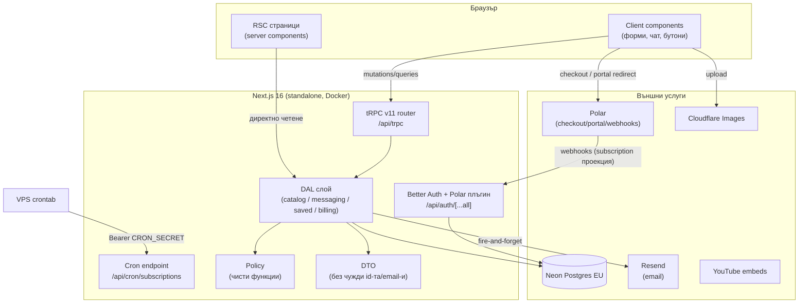
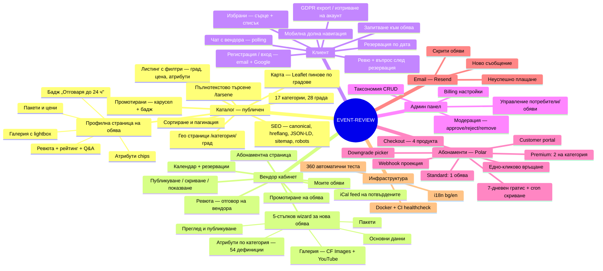
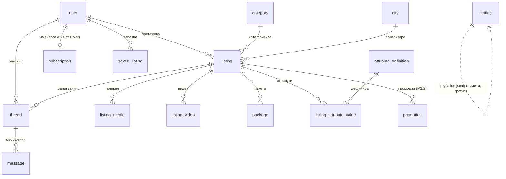

# EVENT-REVIEW

**Маркетплейс за сватбени и събитийни услуги в България** — платформа, в която доставчици (фотографи, ресторанти, музиканти, декоратори…) публикуват обяви, а клиенти търсят, запазват, пращат запитвания, чатят, резервират и оставят ревюта. Референтен модел: WeddingWire.

> Проектни документи: PRD в `Docs/superpowers/specs/2026-07-04-event-review-platform-design.md`, Tech Spec в `Docs/superpowers/specs/2026-07-06-event-review-tech-spec.md`, архитектурни решения в `docs/adr/`, глосарий в `CONTEXT.md`.

---

## Съдържание

1. [Технологичен стек](#технологичен-стек)
2. [Архитектура и модули](#архитектура-и-модули)
3. [Какво е направено до момента](#какво-е-направено-до-момента)
4. [Какво предстои (roadmap)](#какво-предстои-roadmap)
5. [Инсталация стъпка по стъпка](#инсталация-стъпка-по-стъпка)
6. [Настройка на външните услуги](#настройка-на-външните-услуги)
   - [Neon (Postgres)](#1-neon-postgres--задължително)
   - [Better Auth](#2-better-auth--задължително)
   - [Polar (абонаменти)](#3-polar-абонаменти--за-фаза-2)
   - [Resend (email)](#4-resend-email--опционално-за-dev)
   - [Cloudflare Images](#5-cloudflare-images--опционално-за-dev)
   - [Cron (VPS)](#6-cron-vps--за-production)
7. [Как се използва приложението](#как-се-използва-приложението)
8. [Команди](#команди)
9. [Тестове](#тестове)
10. [Структура на проекта](#структура-на-проекта)
11. [Deployment](#deployment)

---

## Технологичен стек

| Слой | Технология | Бележка |
|---|---|---|
| Framework | **Next.js 16.2.10** (App Router, standalone) | ⚠️ Форкната версия с breaking changes — виж `AGENTS.md`; винаги четете `node_modules/next/dist/docs/` |
| UI | React 19, Tailwind CSS v4, shadcn/ui (Radix), lucide-react, sonner | Дизайн: stone неутрали + винено `#9F1239`, шрифтове Cormorant + Inter, mobile-first, touch ≥44px |
| API | **tRPC v11** | Единствената клиентска граница — **без Server Actions** (ADR 0002); RSC четат DAL директно |
| База данни | **Neon Postgres (EU)** + **Drizzle ORM** | `@neondatabase/serverless` Pool driver (поддържа транзакции); ADR 0001 |
| Автентикация | **Better Auth 1.6** | Email+парола, Google OAuth (условен), Drizzle adapter |
| Плащания | **Polar** (`@polar-sh/better-auth`) | Merchant of Record (ДДС/фактури); checkout, customer portal, webhooks — през един endpoint |
| Email | **Resend** | Транзакционни писма (string-builder шаблони в `src/lib/email.ts`) |
| Снимки | **Cloudflare Images** | Graceful degradation без ключове (`CF_NOT_CONFIGURED`) |
| Видео | YouTube embeds | Само URL, без хостване |
| i18n | **next-intl** | Български (без префикс) + английски (`/en`); byte-mirrored ключове в `messages/` |
| Валидация | Zod v4 + react-hook-form | |
| Тестове | Vitest | Unit + интеграционни срещу dev Neon |
| Хостинг | Hostinger VPS (Docker) + crontab | ADR 0003 — без Vercel |

**Методология:** DAL / DTO / Policy навсякъде (по образеца на `demo/pro-dal-local-main`), SOLID, Repository/Service pattern, мащаб 100k+ потребители.

---

## Архитектура и модули

### Обща архитектура



### Модули и функционалности (към момента)



### Домейни в базата данни (29 таблици)



*(Пълната схема — 29 таблици вкл. резервации/ревюта/Q&A за Фаза 3 — е в `src/db/schema/` и Tech Spec §4.)*

---

## Какво е направено до момента

| Milestone | Статус | Какво включва |
|---|---|---|
| **M0 — Фундамент** | ✅ | Scaffold, пълна DB схема (29 таблици + анти-double-booking индекс), seed (17 категории / 28 града), Better Auth (email + условен Google), tRPC скелет, next-intl, дизайн токени + shadcn, Docker + CI healthcheck, auth UI (`/vhod`, `/registratsia`) |
| **M1.1 — Обяви (vendor)** | ✅ | Домейн слой (Listing/Attribute/Package/Video/Media DAL), 54 атрибутни дефиниции, BG slugify, YouTube parser, CF Images (graceful без ключове), vendor UI: Моите обяви + 5-стъпков wizard + publish/hide/unhide |
| **M1.2 — Публичен каталог** | ✅ | `/[category]` (филтри град/цена/атрибути, сорт, пагинация), `/[category]/[city]`, `/obiava/[slug]` профилна, `/tarsene` (tsvector), начална страница, SEO пакет (canonical/hreflang/JSON-LD/sitemap/robots), `unstable_cache` + `revalidateTag` инвалидация, 5 partial индекса |
| **M1.3 — Избрани + чат + email** | ✅ | SaveButton + `/profil/izbrani`, запитване → thread → чат (`/profil/saobshtenia`, polling 5s), бадж „Отговаря до 24 ч", Resend „ново съобщение", мобилна долна навигация, unread брояч |
| **M2.1 — Абонаменти (Polar) + лимити** | ✅ | Polar checkout (Standard/Premium × месечен/годишен), customer portal, webhook проекция, публикационни лимити (Standard: 1 обява; Premium: 2 на категория) при публикуване, 7-дневен гратис при неуспешно плащане + cron скриване, downgrade picker, едно-кликово връщане, 2 email-а, `/profil/dostavchik/abonament` UI |
| **M2.2 — Промотиране** | ✅ | Промо слотове (Premium: включени с лимит; Standard: еднократно докупуване през Polar `order.paid`), карусел на началната страница, promoted приоритет + бадж в каталога, календарен промо прозорец (тече и при скрита обява), `PromotionManager` UI, споделен guard «1 активна промоция/обява» |
| **M2.3 — Админ панел** | ✅ | Admin dashboard, модерация (`pending_approval` влиза в сила — обявите чакат одобрение → approve/reject/remove с атомарен CAS + entitlement guard), управление на потребители/обяви, таксономия (категории/атрибути/градове/региони CRUD), конфигурируеми billing настройки, 22 `adminProcedure` зад единствен choke-point |
| **Ф3 — M3.1 Резервации** | ✅ | Календар per обява (ADR 0004), заявка → потвърждение (advisory-lock + CAS, auto-decline на конкурентни), статус-машина (pending→confirmed→completed / cancelled / declined), auto-complete cron, Sofia TZ навсякъде, email-и, `/profil/dostavchik/kalendar` + `/rezervacii` |
| **Ф3 — M3.2 Ревюта + Q&A** | ✅ | Ревю само след потвърдена резервация, звезден рейтинг + агрегат (транзакционен recompute), 48ч редакция, отговор на вендора, публични въпроси/отговори, report, AggregateRating/Review JSON-LD |
| **Ф3 — M3.3 Hardening** | ✅ | GDPR export (пълни данни) + delete/erase account (session lockout + PII purge + кеш инвалидация), authorship само през `user.name` join, removed изключен от всички публични queries |
| **Ф4 — M4.1 Карта на каталога** | ✅ | Leaflet карта (react-leaflet v5, `ssr:false`) с брой-обяви пинове по градове (28 областни центъра), list/map toggle, `countByCity` DAL + отделен cache key, gео-линкове с locale префикс |
| **Ф4 — M4.2 iCal календарен feed** | ✅ | RFC 5545 feed на потвърдените резервации (`/api/calendar/vendor/{token}.ics`), per-vendor bearer токен (генерирай/ротирай/отмени), Sofia VTIMEZONE, full-day + часови събития, без телефон/PII, `private, no-store`, `IcalFeedCard` UI |

**Тестове:** 360 (67 файла — unit + интеграционни срещу dev Neon). **E2E:** Playwright walkthrough на всеки milestone.

---

## Какво предстои (roadmap)

Всички milestone-и M0–M4.2 са завършени и merge-нати. Оставащото е предимно production-readiness и външно provisioning:

| Тема | Обхват |
|---|---|
| **Жива Polar верификация** | Реален sandbox checkout/portal/webhook + `order.paid` за промоции — да се докаже, че `referenceId`/`metadata` стигат до проекцията (кодът е complete, чака ключове + webhook endpoint) |
| **Cloudflare Images variants** | Paid планът е активен, upload/delivery работят end-to-end; остава да се създадат named variants `thumb`/`card`/`cover`/`gallery` в dashboard-а |
| **Rate limiting** | Изрично отложено от M3.3 — запитвания/регистрация/report повърхности |
| **Follow-up листи** | Натрупаните Minor/Important бележки от review-ите (в `.superpowers/sdd/progress.md`) |

Отложени съзнателно: цена на Premium (задава се в Polar преди старта), компенсации/удължаване на промоции (админ), атрибути на промотирани категории.

---

## Инсталация стъпка по стъпка

### Изисквания

- **Node.js 20+**
- **pnpm 10** (`corepack enable && corepack prepare pnpm@10.33.0 --activate`)
- Акаунт в [Neon](https://neon.tech) (задължително) — останалите услуги са опционални за dev

### 1. Клониране и зависимости

```bash
git clone https://github.com/kostadindraganov/event-saas.git
cd event-saas
pnpm install
```

### 2.環 Environment променливи

```bash
cp .env.example .env
```

Попълнете `.env` (детайли за всяка услуга — в [следващата секция](#настройка-на-външните-услуги)):

| Променлива | Задължителна? | Описание |
|---|---|---|
| `DATABASE_URL` | ✅ ДА | Neon **pooled** connection string |
| `BETTER_AUTH_SECRET` | ✅ ДА | Случаен низ ≥32 знака: `openssl rand -base64 32` |
| `BETTER_AUTH_URL` | ✅ ДА | `http://localhost:3000` за dev |
| `NEXT_PUBLIC_APP_URL` | ✅ ДА | `http://localhost:3000` за dev |
| `GOOGLE_CLIENT_ID/SECRET` | ➖ не | Google OAuth — без тях бутонът просто липсва |
| `CRON_SECRET` | ➖ dev / ✅ prod | Пази `/api/cron/subscriptions` |
| `CLOUDFLARE_*` | ➖ не | Без тях upload-ът показва «не е конфигуриран», всичко друго работи |
| `RESEND_API_KEY`, `EMAIL_FROM` | ➖ не | Без ключ email-ите се пропускат с warning (не чупят нищо) |
| `POLAR_ACCESS_TOKEN` | ➖ не | Без него Polar плъгинът изобщо не се зарежда — публикуването обаче ще иска абонамент (виж по-долу) |
| `POLAR_WEBHOOK_SECRET` | ➖ не | Без него webhooks частта не се монтира |
| `POLAR_ENV` | ➖ | `sandbox` (по подразбиране) или `production` |
| `POLAR_PRODUCT_*` (4 бр.) | ➖ не | Product ID-та от Polar dashboard |

> ⚠️ **Никога не слагайте реални стойности в `.env.example`** — той е committed. Секретите живеят само в `.env` (gitignored).

### 3. База данни (миграции + seed)

```bash
pnpm db:migrate          # прилага drizzle/ миграциите върху DATABASE_URL
pnpm db:seed             # 17 категории, 28 града, 54 атрибутни дефиниции, billing настройки
pnpm db:seed:listings    # (опционално) 39 демо обяви за разработка
```

### 4. Старт

```bash
pnpm dev                 # http://localhost:3000
```

Проверка: `curl http://localhost:3000/api/health` → `{"ok":true,"db":true}`.

### 5. (Опционално) Тестов абонамент за dev без Polar

Публикуването на обява изисква активен абонамент. Без Polar ключове за локална разработка вмъкнете ръчно ред в `subscription` (например през `pnpm db:studio`): `userId` = вашият user id, `polarSubscriptionId` = произволен уникален низ, `plan` = `premium`, `status` = `active`. Тестовете правят точно това чрез `createTestSubscription()`.

---

## Настройка на външните услуги

### 1. Neon (Postgres) — задължително

1. Създайте проект в [console.neon.tech](https://console.neon.tech) — **регион EU** (Frankfurt), заради GDPR и латентност.
2. Копирайте **pooled** connection string-а (с `-pooler` в host-а) → `DATABASE_URL`. Драйверът е `@neondatabase/serverless` Pool — поддържа интерактивни транзакции, които DAL слоят ползва.
3. `pnpm db:migrate && pnpm db:seed`.
4. Препоръка: отделен Neon branch за dev/тестове — интеграционните тестове пишат реални редове (изолирани per-owner, но все пак).

### 2. Better Auth — задължително

1. `BETTER_AUTH_SECRET` — `openssl rand -base64 32`.
2. `BETTER_AUTH_URL` = базовият URL на приложението (`http://localhost:3000` / `https://вашият-домейн`).
3. **Google OAuth (опционално):** [console.cloud.google.com](https://console.cloud.google.com) → Credentials → OAuth Client ID (Web) → Authorized redirect URI: `{BETTER_AUTH_URL}/api/auth/callback/google` → копирайте ID/Secret в `.env`. Без тях формата за вход работи само с email+парола.
4. Схемата на Better Auth (user/session/account/verification) е част от Drizzle миграциите — нищо допълнително.

### 3. Polar (абонаменти) — за Фаза 2

Истината за абонамента живее в Polar; локалната `subscription` таблица е само проекция, попълвана от webhooks.

1. **Акаунт:** [sandbox.polar.sh](https://sandbox.polar.sh) за разработка (production ключовете са отделни — не се споделят между средите!).
2. **Организация → Products:** създайте **4 продукта** (цените са във ваша власт; Premium цената още не е финализирана — сложете placeholder):
   | Продукт | Тип | ENV променлива |
   |---|---|---|
   | Standard — месечен | Subscription, monthly | `POLAR_PRODUCT_STANDARD_MONTHLY` |
   | Standard — годишен | Subscription, yearly | `POLAR_PRODUCT_STANDARD_YEARLY` |
   | Premium — месечен | Subscription, monthly | `POLAR_PRODUCT_PREMIUM_MONTHLY` |
   | Premium — годишен | Subscription, yearly | `POLAR_PRODUCT_PREMIUM_YEARLY` |
   Копирайте **Product ID**-тата в `.env`.
3. **Access token:** Settings → Developers → New token → `POLAR_ACCESS_TOKEN`. `POLAR_ENV=sandbox`.
4. **Webhook:** Settings → Webhooks → Add endpoint:
   - URL: `{BETTER_AUTH_URL}/api/auth/polar/webhooks` (Polar плъгинът се монтира под Better Auth catch-all route-а — няма отделен webhook файл в кода)
   - Format: **Raw**
   - Events: `subscription.created/updated/active/canceled/revoked/uncanceled`, `order.paid`
   - Секретът → `POLAR_WEBHOOK_SECRET`
   - За локална разработка: `ngrok http 3000` (или Polar CLI) и регистрирайте ngrok URL-а.
5. **Как работи целият поток:**
   - Регистрация НЕ създава Polar customer (умишлено — иначе Polar outage би чупил регистрацията); customer-ът се създава lazily при първия checkout чрез `externalCustomerId = user.id`.
   - Клиентът натиска «Избери план» → `authClient.checkout({ slug })` → Polar hosted checkout → плащане.
   - Polar праща webhook → `projectSubscriptionEvent()` прави идемпотентен upsert в `subscription`.
   - Публикуване на обява минава през entitlement guard: `active` или `past_due` в 7-дневния гратис.
   - Неуспешно плащане → Polar retry → `past_due` + email; след 7 дни cron-ът скрива обявите (`hiddenBySystem`); подновяване → бутон «Върни обявите».
   - Смяна на карта/фактури: бутон «Управление на плащането» → Polar customer portal.
6. **Лимити и гратис дни** са конфигурируеми в таблица `setting` (`billing.limits` = `{"standard":1,"premiumPerCategory":2}`, `billing.graceDays` = `7`) — seed-ът ги вмъква; кодът има същите defaults.

### 4. Resend (email) — опционално за dev

1. [resend.com](https://resend.com) → API key → `RESEND_API_KEY`.
2. Верифицирайте домейн (production) и задайте `EMAIL_FROM` (напр. `EVENT-REVIEW <noreply@вашият-домейн>`).
3. Изпращат се: ново съобщение в чата, неуспешно плащане (past_due), скрити обяви след гратиса. Всички са fire-and-forget — грешка в email никога не проваля операцията. Без ключ: еднократен warning в лога и нищо не се праща.

### 5. Cloudflare Images — опционално за dev

1. Cloudflare dashboard → Images → активирайте.
2. `CLOUDFLARE_ACCOUNT_ID` (Overview), `CLOUDFLARE_IMAGES_API_TOKEN` (API token с Images:Edit), `CLOUDFLARE_IMAGES_ACCOUNT_HASH` и `NEXT_PUBLIC_CLOUDFLARE_IMAGES_HASH` (delivery hash от Images → Developer Resources).
3. Без тези ключове wizard-ът показва «качването не е конфигурирано», а YouTube видеата работят нормално.

### 6. Cron (VPS) — за production

Гратис-изтичането се обработва от защитен endpoint, който VPS crontab вика (ADR 0003 — без Vercel Cron):

```cron
# /etc/crontab — веднъж на час
0 * * * * root curl -s -X POST -H "Authorization: Bearer ${CRON_SECRET}" https://вашият-домейн/api/cron/subscriptions
```

Endpoint-ът е идемпотентен (повторно викане не скрива/не праща нищо два пъти) и връща `{"hidden": N}`.

---

## Как се използва приложението

### Като клиент (търсещ услуга)

1. **Разглеждане без регистрация:** начална страница → категория (напр. `/fotografi`) → филтри по град/цена/атрибути → профилна страница на обява (`/obiava/{slug}`) с галерия, пакети, цени. Търсене: `/tarsene?q=...`.
2. **Регистрация/вход:** `/registratsia` или `/vhod` (email+парола или Google).
3. **Избрани:** сърцето върху карта/профил запазва обявата → списък в `/profil/izbrani`.
4. **Запитване:** от профилната страница — съобщение + желана дата + телефон (по избор) → създава се чат нишка.
5. **Чат:** `/profil/saobshtenia` — всички разговори с брояч на непрочетени (и в мобилната долна навигация); повторно запитване към същата обява продължава същия разговор.
6. **Резервация:** от профилната страница избирате дата → заявка → вендорът потвърждава/отказва; след потвърдена резервация можете да оставите **ревю** (звезди + текст, 48ч редакция) и да зададете **публичен въпрос**.
7. **Данни:** `/profil` → експорт на данните (GDPR) или изтриване на акаунта.

### Като доставчик (вендор)

1. Регистрирайте се като обикновен потребител — няма отделен «vendor акаунт»; ставате доставчик като публикувате обява.
2. **Абонамент:** `/profil/dostavchik/abonament` → изберете план → Polar checkout. **Standard** = 1 публикувана обява; **Premium** = до 2 във всяка категория. Чернови се пишат свободно и без абонамент.
3. **Нова обява:** `/profil/dostavchik/obiavi` → «Нова обява» → 5 стъпки: основни данни → атрибути (специфични за категорията) → галерия (снимки + YouTube) → пакети с цени → преглед и публикуване.
4. **Управление:** скриване/показване на обява (скриването спира само НОВИ запитвания — съществуващите чатове продължават), редакция, пакети.
5. **Запитвания:** отговаряте в същия чат; бързите отговори ви носят бадж «Отговаря до 24 ч» на профилната страница.
6. **Промотиране:** Premium има включени слотове; Standard докупува еднократно през Polar. Промотираната обява влиза в карусела на началната страница и получава приоритет + бадж в каталога.
7. **Резервации:** `/profil/dostavchik/kalendar` — календар с потвърдените дати; `/profil/dostavchik/rezervacii` — входящи заявки за потвърждение/отказ (конкурентните за същата дата се auto-decline-ват). **iCal feed:** генерирате личен линк (`.ics`), който синхронизира потвърдените резервации с Google/Apple календар; можете да го ротирате или отмените.
8. **Ревюта:** клиентите оставят ревю след потвърдена резервация; вие отговаряте публично.
9. **Плащания:** «Управление на плащането» отваря Polar портала (карта, фактури, смяна/спиране на план). При downgrade Premium→Standard избирате коя обява остава публична.

### Роли и права

| Роля | Права |
|---|---|
| Гост | Разглежда, търси, чете профили |
| Потребител | + Избрани, запитвания, чат, чернови на обяви |
| Потребител с абонамент | + Публикуване на обяви (по лимита на плана), промотиране, календар/резервации |
| Админ (`user.isAdmin`) | + Модерация (approve/reject/remove), таксономия CRUD, потребители/обяви, billing настройки |

---

## Команди

| Команда | Какво прави |
|---|---|
| `pnpm dev` | Dev сървър на :3000 |
| `pnpm build` | Production build (standalone) |
| `pnpm start` | Production сървър |
| `pnpm test` | Целият Vitest suite (изисква `DATABASE_URL` — интеграционните тестове пишат в dev базата) |
| `pnpm lint` | ESLint |
| `pnpm tsc --noEmit` | Type check |
| `pnpm db:generate` | Генерира миграция от промени в `src/db/schema/` |
| `pnpm db:migrate` | Прилага миграциите |
| `pnpm db:seed` | Категории/градове/атрибути/настройки (идемпотентен) |
| `pnpm db:seed:listings` | Демо обяви |
| `pnpm db:studio` | Drizzle Studio (GUI за базата) |

---

## Тестове

- **360 теста / 67 файла** — unit (policy, email шаблони, парсери, iCal builder) + интеграционни (DAL срещу реална Neon база).
- Конвенции: тестовете създават собствени потребители (`createTestUser`) и чистят след себе си (`cleanupTestUser`); асершъните са scoped по owner/id — никога абсолютни броения (базата е споделена); абонаментни състояния се симулират с `createTestSubscription(userId, {plan, status, graceUntil})`.
- E2E: Playwright walkthrough per milestone (скрийншоти в `.superpowers/sdd/e2e-shots/`).

---

## Структура на проекта

```
src/
├── app/
│   ├── [locale]/                  # bg (без префикс) / en
│   │   ├── page.tsx               # начална (+ промотиран карусел)
│   │   ├── [category]/            # каталог (list/map toggle) + [city] гео
│   │   ├── obiava/[slug]/         # профилна: галерия/пакети/ревюта/Q&A/резервация
│   │   ├── tarsene/               # търсене
│   │   ├── admin/                 # админ панел (M2.3) — модерация, таксономия, настройки
│   │   ├── (auth)/vhod, registratsia
│   │   └── profil/
│   │       ├── izbrani/           # избрани
│   │       ├── saobshtenia/       # чат inbox + [threadId]
│   │       ├── rezervacii/        # моите резервации (M3.1)
│   │       ├── nastroiki/         # GDPR export / изтриване на акаунт (M3.3)
│   │       └── dostavchik/
│   │           ├── obiavi/        # моите обяви + wizard
│   │           ├── abonament/     # абонамент (M2.1)
│   │           ├── promotirane/   # промотиране (M2.2)
│   │           ├── kalendar/      # календар + iCal feed (M3.1/M4.2)
│   │           └── recenzii/      # ревюта на моите обяви (M3.2)
│   └── api/
│       ├── auth/[...all]/         # Better Auth + Polar (checkout/portal/webhooks)
│       ├── trpc/[trpc]/           # tRPC handler
│       ├── calendar/vendor/[token]/  # публичен iCal .ics feed (M4.2)
│       ├── account/               # GDPR export/erase (M3.3)
│       ├── cron/subscriptions/    # гратис-изтичане (CRON_SECRET)
│       ├── cron/auto-complete/    # авто-завършване на минали резервации (M3.1)
│       └── health/                # {ok, db}
├── data/                          # DAL + DTO + Policy per домейн
│   ├── catalog/                   # обяви, атрибути, пакети, публичен каталог, карта
│   ├── messaging/                 # запитвания/чат
│   ├── saved/                     # избрани
│   ├── booking/                   # резервации, календар, iCal (M3.1/M4.2)
│   ├── reviews/                   # ревюта + Q&A + report (M3.2)
│   ├── admin/                     # модерация, таксономия, настройки (M2.3)
│   ├── account/                   # GDPR export/erase (M3.3)
│   └── billing/                   # абонаменти, промоции, entitlement, webhook проекция
├── trpc/routers/                  # catalog, media, saved, messaging, billing, booking, review, qa, report, admin, account
├── db/schema/                     # Drizzle схема (auth, catalog, billing, messaging…)
├── lib/                           # auth, auth-client, email, cf-images, youtube…
├── components/                    # ui/ (shadcn), catalog/, vendor/, messaging/, billing/…
├── i18n/                          # next-intl routing/navigation
└── test/                          # db-helpers (createTestUser/Subscription, cleanup)
messages/                          # bg.json / en.json (byte-mirrored)
drizzle/                           # SQL миграции
scripts/                           # seed скриптове
Docs/superpowers/                  # PRD, Tech Spec, имплементационни планове
docs/adr/                          # архитектурни решения 0001–0005
CONTEXT.md                         # домейн глосарий
```

---

## Deployment

Production рецептата (ADR 0003): **Hostinger VPS + Docker**, без Vercel.

1. `Dockerfile` строи standalone Next.js image; healthcheck удря `/api/health` (проверява и базата).
2. CI (GitHub Actions) строи image-а; добавете стъпка `pnpm db:migrate` преди старта на новия контейнер.
3. Env променливите се подават на контейнера (никога не се пекат в image-а).
4. Crontab на VPS-а вика cron endpoint-а (виж [Cron секцията](#6-cron-vps--за-production)).
5. Polar: превключете на production организация — нов `POLAR_ACCESS_TOKEN`, нов webhook (production URL + secret), нови product ID-та, `POLAR_ENV=production`.
6. Resend: верифициран домейн + production `EMAIL_FROM`.

---

*Проектът се разработва milestone по milestone със subagent-driven development; журналът на изпълнението е в `.superpowers/sdd/progress.md`, а плановете — в `Docs/superpowers/plans/`.*
